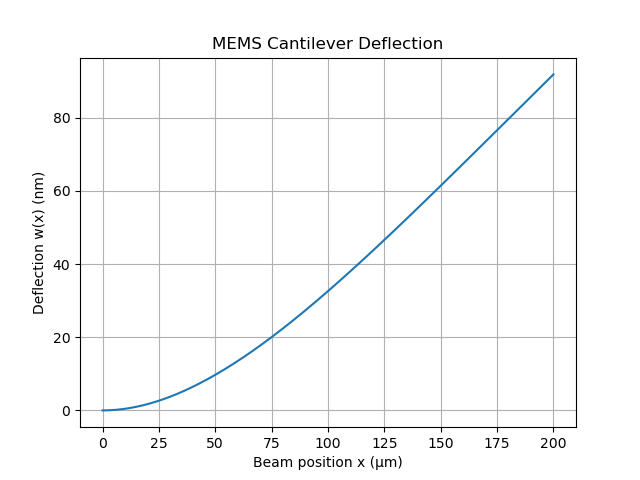
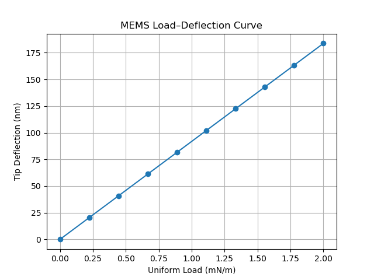
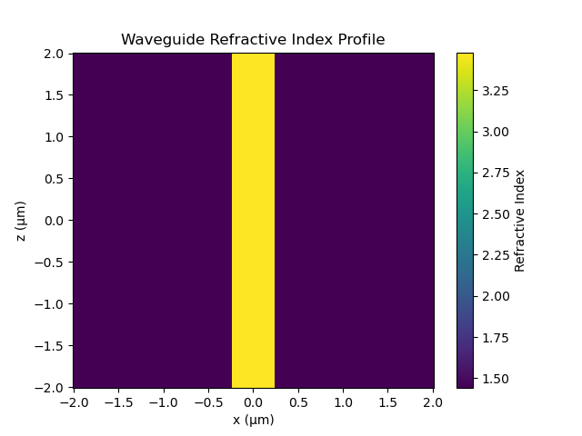
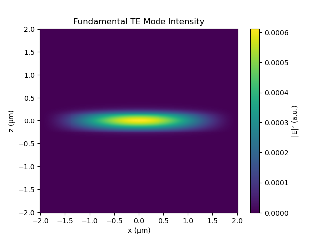
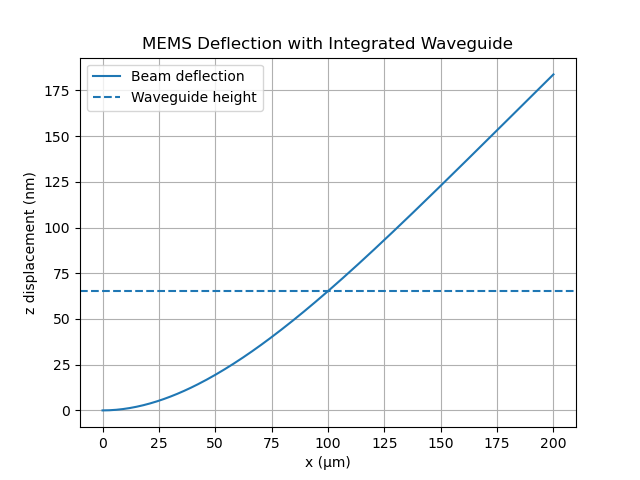
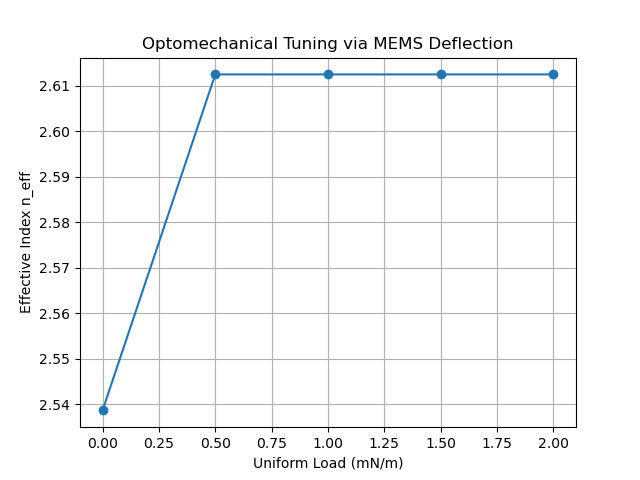
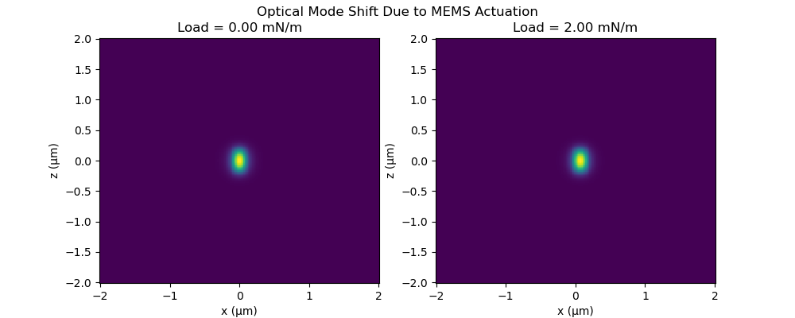

# Automated Multiphysics Simulation of MEMS Cantilever and Integrated Optical Waveguides
*NOTE: We have currently only implemented starter code, and are actively validating this framework.*


# 1.  Problem overview
An interesting solution for microscale scanning projection systems can be found by fabricating an array of waveguies on a surface that oscillates mechanically at a tunable frequency. Utilizing elecromechanically induced stess & strain, MEMS cantilever tips offer a common industry solution. 


This is an interesting multiphysics modeling problem for a few reasons:
- In order to produce a scanning projector output, we need to optimize the optical output at the waveguide & cantilever tip, and the scan rate produced by vibration
- The scan rate, determined by the resonant frequency of the cantilever, is influenced by it's designed geometry & material properties. 
- The optical output is depended on the waveguide geometry and refractive properties. the geometry is perturbed by deflection of the MEMS substrate, and the refractive properties are pertubed by induced stress and strain from deflection..

In summary, this system is a great intersection of electrical, mechanical, and optical interactions across different physical scales.
## Physics Model workflow:
We will start with a simple 1-D model, coupling the MEMS and waveguide physics, and explore surrogate machine learning models. Once validated, we move on to two and three dimensional models, requiring more advanced computational techniques like FEA and FDTD. 

Our general workflow is:
1. Compute optical mode physics for a unperturbed waveguide design.
2. Calculate the deflection for a cantilever design given a drive signal. 
3. Recompute the optical propagation on the deformed geometry

This abstraction is informed by industry applications in Tunable photonic MEMS, Phase shifters and Optomechanical sensors.
Using the multiphysics framework, we construct a digital twin workflow to train machine learning surrogates. 

Below we list the machine learning framework and how these relate to the physics engine. (*WIP*)
- Simulation -> Ground truth
- Surrogate -> Fast approximation
- Active learning -> Smart sampling
- Bayesian optimization -> Design targeting
- Physics-informed features -> Structure & generalization

# 2. Physics models
Currently, we have only implemented 1D simple models, and are still validating the results in this simple regime. 
### Mechanics

The MEMS mechanics are computed on a Euler–Bernoulli cantilever beam model (classical beam theory) with finite-difference solver. This model is a simplification of the linear theory of elasticity. 

Transverse deflection $w(x)$ is governed by

$$ EI \frac{d^4w}{dx^4} = q(x)$$

Where E is young's modulus, I is the area-moment of inertia, and q(x) is the distributed load in N/m. We implement the following boundary conditions: 

At fixed end $x = 0$:
- $w(0) = 0$
- $w'(0) = 0$

At the free end $x=L$

- $w''(L) = 0$
- $w''''(L) = 0$

The analytic solution can be compared to a finite difference model, by approximating the 4th derivative:

$$ \frac{d^4w}{dx^4} \approx \frac{w_{i-2} - 4 w_{i-1} + 6w_i-4w_{i+1} + w_{i+2}}{\Delta x^4} $$

and solving the linear system 

$$ \mathbf{K w} = \mathbf{f} $$

where K is an operator encoding the dynamics of the displacement state vector w. 

### Optics

For the optical model, we analyze a 1D slab waveguide using the effective index method. The optical physics are computed by solving the Helmholtz equation.

$$ \nabla^2 E + k_0^2n^2(x,z)E = \beta^2 E $$
where $k_0$ is the wavenumber, $\beta = k_0n_{eff}$ is the propogation constant, and $n(x,z)$ is the refractive index.  We formulate this as a matrix eigenvalue problem using separation of variables:

$$ \mathcal{H}\psi = \beta^2\psi $$

Where:
- the operator $\mathcal{H}$ is

$$ \mathcal{H} = \nabla^2_{\perp}+k_0^2n^2(x,y) $$

- The eigenfunction $\psi$ encodes the transverse mode
- $\beta^2$ is the eigenvalue, encoding the refractive properties of the system.
 

This is a similar methodology to industry solvers like Lumerical MODE. To solve the finite element problem, we discretize the as follows:

$$ (L + V)\psi = \beta^2\psi $$

Where 
- L is the discrete laplacian
- V is a diagonalized matrix containing the eigenvalues.

Lastly, we use Dirichlet boundary conditions with a sufficiently padded domain so that the guided modes decay to near zero before reaching the boundary. This approximates the open boundary condition while preserving a Hermitian eigenproblem, which keeps the mode solver fast and numerically stable.

### Coupling

The coupled physics are computed via the following workflow:

1. MEMS Solver
2. Beam deflection $w(x)$
3. Waveguide center displacement $\delta z(x)$
4. Updated refractive index profile $n(x,z; w)$
5. Optical mode solver

This implements a simple geometry mapping. We assume:
- Waveguide runs along MEMS beam axis $ x $
- Optical solver works on a local cross-section
- Deflection at a given $ 𝑥_0 $ shifts the waveguide vertically
$$ z_{wg}(x_0) = z_0 + w(x_0) $$
This lets us simulate:
- Static tuning
- Local curvature effects (WIP)
- Phase modulation (WIP)


# 3. Software architecture
We aim for genralizable & modular object-oriented design. Note that some of these files and directories are currently empty, and will be populated as we add more examples and features.

For example, Coupling API is structured as follows:
```
class MemsPhotonicSystem:
    def solve_static_response(...)
    def optical_response_vs_load(...)
```


We include end-to-end demo scripts to showcase:
- Multiphysics coupling
- PDE solvers
- Geometry deformation
- Optical mode sensitivity
- Software architecture
- Physics intuition

See section 4 & 5 for details on how to run the demo systems.

# 4. Example results
The following files run example workflows and generate visualizations to vaildate the flow and physics.
### 1. run_mems.py — MEMS Mechanics Visualization:
    - Cantilever deflection shape
    - How deflection scales with load





### 2.  run_slab.py — Optical Mode Visualization:

Refractive Index Profile



Optical Mode Intensity




### 3. run_coupled.py — MEMS + Optics Visualization:

Deflected Beam with Waveguide Location - shows point at which the waveguide is deflected beyond it's height. 



Effective Index vs Load



Optical Mode Evolution




These results are to prove the software workflow & basic physical sensibility.

# 5. How to run
We reccomend creating a virtual environment to experiemnt with the codebase. A requirement.txt is included for ease of setup.

The folder 'simulation' contains three demo files that construct these physical systems, and generates the figures shown in the the 'example results' section of this readme. 
- run_mems.py
- run_slab.py
- run_coupled.py

# 6. Extensions (ML surrogates, optimization, Fabrication & Uncertainty Modeling)
The following sections are even more 'under development' than the prior features, but serve as a software framework to implement digital-twin features. 


## ML Surrogate Modeling:
Goal: Replace repeated coupled MEMS–photonics simulations with a fast, learned surrogate model that predicts optical response from mechanical actuation parameters.

workflow:


1. Generate dataset from coupled solver. 

2. Train baseline ML models.
    - investigate approximate linearity with Linear Regression
    - Model as a gaussian process regression, laying the foundation for an active learning process via Bayesian optimization. 
    - Model as a neural network MLP regression, set the stage for pjhysics-informed network architectures.

3. evaluate surrogates for accuracy, error across the feature space, uncertainty for the gaussian process, and speed benchmarks. 


## Physics extentions (To-Do)
- Strain-optic (photoelastic) index change
- Optical loss due to bending
- Dynamic MEMS (time-domain)
- 2D solvers (FEA, 2D MODE, FDTD)

A Gaussian process surrogate model was trained to replace repeated multiphysics MEMS–photonics simulations, achieving sub-percent prediction error while reducing evaluation time by orders of magnitude.


